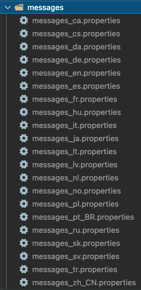

# 🌐 Adding text keys

In Keycloakify you can't directly eddit the `messages_xx.properties` files, the way to go it to reproduce [this approach](https://github.com/garronej/keycloakify-demo-app/blob/main/src/kcMessagesExtension.ts) ( don't forget to [evaluate the code](https://github.com/garronej/keycloakify-demo-app/blob/0a6d349dba89a5702f98ba48bca6c76ac7265e1f/src/index.tsx#L15) ).


This approach is a bit hacky as it doesn't provide type safety, it needs to be improved. &#x20;

In the meantime see [this issue](https://github.com/InseeFrLab/keycloakify/issues/17) for other workarounds.

