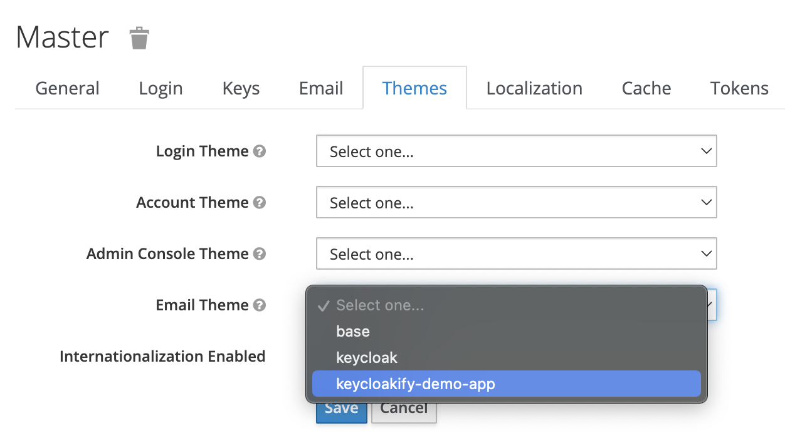

# 📧 Email customization

_Introduced in_ [_v4.8.0_](https://github.com/InseeFrLab/keycloakify/releases/tag/v4.8.0)

It is now possible to customize the emails sent to your users to confirm their email address ect.\
Just run `npx create-keycloak-theme-email-directory`, it will create a `keycloak_theme_email` directory at the root of your project.\
This directory should be tracked by Git (`yarn add -A`) You can start hacking the default template.\
When `npx build-keycloak-theme` (`yarn keycloak`) is run, if the directory `keycloak_theme_email` exists at the root of your project, it will be bundled into your `.jar` file and you will be able to select it in the Keycloak administration pages.

